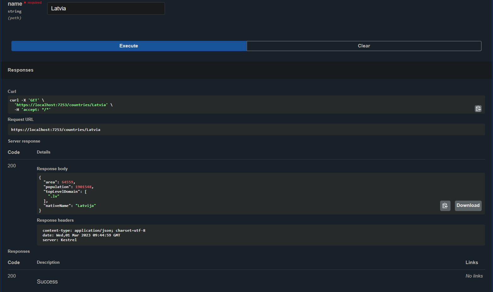
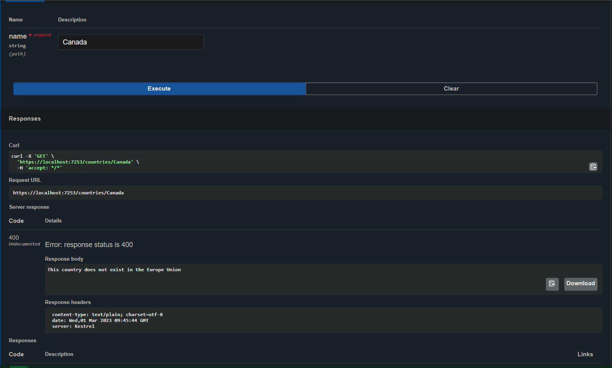

# Countries-API
Create an application to convert arabic numbers to roman numerals.

## To Start it:
1. Clone this repository
2. Open solution file in your compiler
3. Press f5 to compile project and Swagger will automatically open in working port

Open https://localhost:7253/ to view it in your browser.

